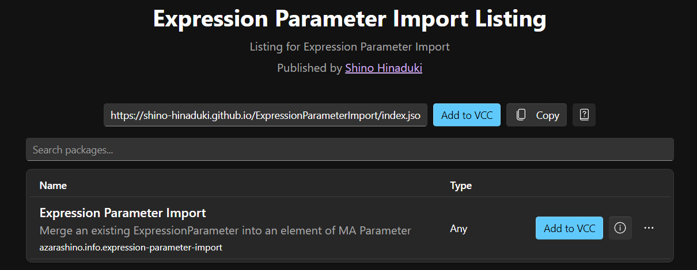
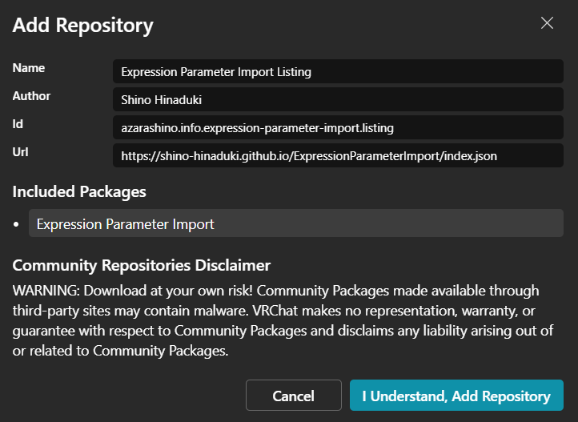
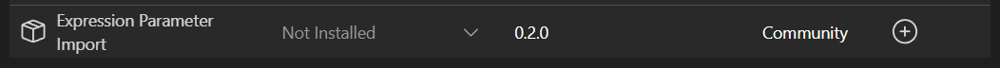
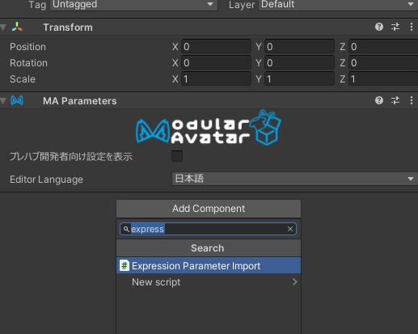
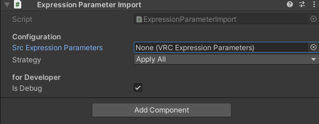
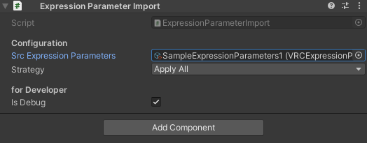
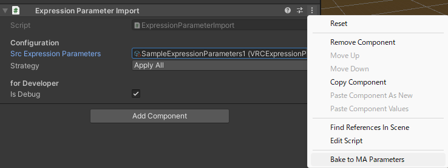
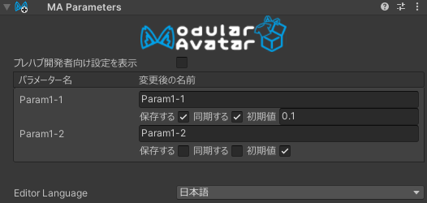

# ExpressionParameterImport

ExpressionParameterImport は [Modular Avatar](https://github.com/bdunderscore/modular-avatar) (以後 MA) 向けの追加コンポーネントです。
既存の ExpressionParameters アセットに記述された設定を [MA Parameters](https://modular-avatar.nadena.dev/ja/docs/reference/parameters) にコピーすることができます。

[Non-Destructive Modular Framework](https://github.com/bdunderscore/ndmf) (以後 NDMF) Plugin 対応しており 、 MA 実行時にコピー可能です。
また、本アセットへの依存性を残すことが懸念であれば、Inspector 上で MA Parameters へ変換 (Bake) する機能も備えています。

MA を使わない想定でセットアップされた Animation, ExpressionParameters を使った制作物を、MA 対応するような利用シーンを想定しています。

## 導入方法

[ExpressionParameterImport package-listing](https://shino-hinaduki.github.io/ExpressionParameterImport/) のページに移動し、`Add to VCC` を押して VCC に追加します。

使用したいプロジェクトを VCC 上で選択し、Manage Packages から ExpressionParameterImport をインポートします

## 使用方法

MA Parameters が追加された GameObject を選択し、Add Component から Expression Parameter Import を追加します

Src Expression Parameters にコピーしたい ExpressionParameters のアセットを設定します

以下の表示になっていればセットアップ完了です。NDMF Plugin として機能し、MA の処理プロセスより前にパラメータが MA Parameters にコピーされます。
(IsDebug はチェックを入れるとパラメータの処理履歴を Console 出力する機能なのでどちらでも問題ないです。Strategy は後述)

## Tips

### ExpressionParameterImport に依存させたくない

ExpressionParameterImport が追加された GameObject を選択し、右上のメニューから Bake to MA Parameters を選択します。

以下のように MA Parameters に値が展開されていたら処理成功です。（ExpressionParameterImport 自体は GameObject から外れます）
また、Scene 直下に Bake 前の GameObject が非アクティブ状態で複製されます。必要に応じて保存か削除をお願いします。

### MA Parameters を付け忘れた

NDMF Plugin, Bake to MA Parameters どちらで動作した場合でも、MA Parameters が見つからない場合は自動的に付与します。

### MA Parameters に同じ値が存在している

ExpressionParameterImport を選択したときの Inspector に表示される Strategy 項から挙動を設定できます。

- Apply All: MA Parameters に同名のパラメータがあった場合、そのまま上書き
- No Overwrite: MA Parameters に同名のパラメータがあった場合、そのパラメータはコピーされない
- Only Overwrite: MA Parameters に同名のパラメータが含まれているもののみ上書き

※X,Y は 共通の Parameter 名を持つ 値

| #   | MA Parameters | ExpressionParameterImport | Apply All | No Overwirte | Only Overwrite |
| --- | ------------- | ------------------------- | --------- | ------------ | -------------- |
| 1   | X             | (設定なし)                | X         | X            | X              |
| 2   | (設定なし)    | Y                         | Y         | Y            | (値なし)       |
| 3   | X             | Y                         | Y         | X            | Y              |

1. MA Parameters で定義された値はそのまま残る
2. MA Parameters に定義がなく、ExpressionParameterImport で定義された値は新規追加扱い。Only Overwrite では Skip される
3. MA Parameters に定義があり、ExpressionParameterImport でも定義された値は上書き扱い。No Overwrite では Skip される

### ExpressionParameters を複数取り込みたい

ExpressionParameterImport は 1 つの GameObject に複数追加することができます。Inspector 表示順で上から処理されます。
先述の Strategy と組み合わせると干渉しないように合成することは可能ですが、複雑なことを行うのであれば MA Parameters への Bake を推奨します。

### Bake to MA Parameters を実施したけど元に戻したい

Bake 直後であれば CTRL + Z で戻せます。もしくは Scene 直下に Bake 前の GameObject が Backup されるのでどちらかから復元をお願いします。
MA Parameters -> ExpressionParameters の逆変換は未実装です。需要があれば検討します。
